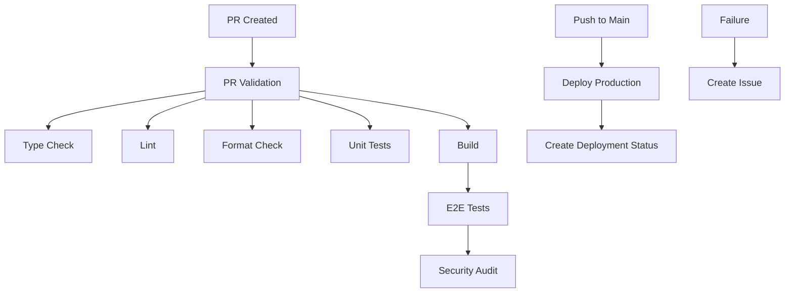

# CI/CD Environment Setup

This document outlines the required environment variables and secrets for the CI/CD pipeline.

## Required GitHub Secrets

The following secrets need to be configured in your GitHub repository settings (`Settings > Secrets and variables > Actions`):

### Deployment Secrets

- `VERCEL_TOKEN` - Your Vercel API token for deployments
- `VERCEL_ORG_ID` - Your Vercel organization ID
- `VERCEL_PROJECT_ID` - Your Vercel project ID

### Application Secrets

- `OPENAI_API_KEY` - OpenAI API key for AI reflection features

### Optional Secrets

- `CODECOV_TOKEN` - Codecov token for coverage reporting (optional but recommended)

## Setting up Vercel Integration

1. **Get Vercel Token:**

   ```bash
   # Install Vercel CLI
   npm i -g vercel

   # Login and get token
   vercel login
   vercel --token
   ```

2. **Get Organization and Project IDs:**

   ```bash
   # Link your project
   vercel link

   # Get org and project IDs from .vercel/project.json
   cat .vercel/project.json
   ```

3. **Add to GitHub Secrets:**
   - Go to repository Settings > Secrets and variables > Actions
   - Add each secret with the values from above

## Environment Variables in CI

The workflow uses these environment variables:

- `NODE_VERSION: '20'` - Node.js version for consistency
- `PNPM_VERSION: '9'` - PNPM version for package management
- `PLAYWRIGHT_TEST_BASE_URL` - Base URL for E2E tests

## Local Development vs CI

| Environment | OpenAI API Key | Vercel Config | Test Database |
| ----------- | -------------- | ------------- | ------------- |
| Local       | `.env.local`   | Manual setup  | Local/Mock    |
| CI (PR)     | Not needed     | Not deployed  | Mock/Test     |
| CI (Main)   | GitHub Secret  | Auto deploy   | Production    |

## Security Considerations

- All secrets are encrypted and only accessible during workflow execution
- Production deployments only occur on the main branch
- PR builds do not have access to production secrets
- Security audit runs on all PRs to check for vulnerabilities

## Troubleshooting

### Common Issues

1. **Missing Vercel Token:**

   ```
   Error: No token found
   ```

   Solution: Add `VERCEL_TOKEN` to GitHub secrets

2. **Build Fails on OpenAI:**

   ```
   Error: OpenAI API key not found
   ```

   Solution: Add `OPENAI_API_KEY` to GitHub secrets (for main branch only)

3. **E2E Tests Fail:**
   ```
   Error: Connection refused
   ```
   Solution: Check if the build step succeeded and the app starts correctly

### Getting Help

If you encounter issues:

1. Check the Actions tab for detailed error logs
2. Verify all required secrets are configured
3. Test locally with the same commands used in CI
4. Review this documentation for missing steps

## Pipeline Overview



This setup ensures code quality, security, and reliable deployments while providing fast feedback to developers.
